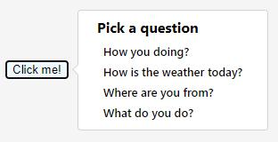

## React Popover

A React popover component built using [Floating UI](https://floating-ui.com/) framework.



---

### Usage

Click on button to display popover section relative to button.

```tsx
<Popover>
    <Target>
        <button>Click on me</button>
    </Target>
    <Content>
        <div>Floating content</div>
    </Content>
</Popover>
```

Controlled from outside the component
```tsx

const [open, setOpen] = useState(false);

<Popover opened={open} onChange={setOpen}>
    <Target>
        <button>Click on me</button>
    </Target>
    <Content>
        <ul>
            <div className="question-heading">Pick a question</div>
            {questions.map(question =>
                <li key={question}>
                    <div className="question" onClick={() => setOpen(false)}>
                        {question}
                    </div>
                </li>
            )}
        </ul>
    </Content>
</Popover>
```