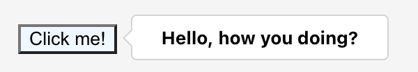

### React Popover

A React popover component built using [Floating UI](https://floating-ui.com/) framework.



---

#### Usage

Click on button to display popover section relative to button.

```tsx
<Popover>
    <Target>
        <button>Click on me</button>
    </Target>
    <Content>
        <div>Floating content</div>
    </Content>
</Popover>
```